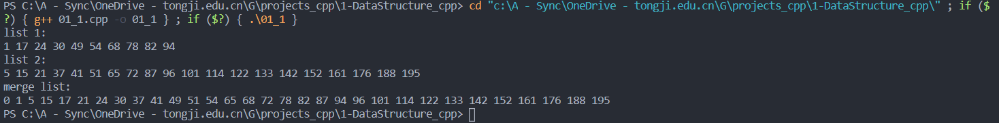

# DSA


## 题目

将两个非递减的有序链表合为一个非递减的有序链表。（要求利用原来两个链表的存储空间，不另外占用其他空间，表中不允许有重复数据）

## 算法分析

本题合并两个有序链表，可循环遍历比较大小后加上剩余项，也可递归调用缩小链表规模直到为空。这里采用递归的方法，递归的深度为$min(m,n)$，时间复杂度也是$O(min(m,n))$

## 代码

```cpp
# include <iostream>
# include <stdlib.h>
using namespace std;

// 1. 定义链表结点
struct ListNode
{
    int data;
    ListNode *next;
    ListNode() : data(0), next(nullptr) {}
    ListNode(int val) : data(val), next(nullptr) {}
};

// 2. 定义链表合并函数，本题核心代码
ListNode* MergeList(ListNode* list_1, ListNode* list_2)
{
    // 递归结束条件，遍历完成，指针为空
    if (list_1 == nullptr)
        return list_2;
    if (list_2 == nullptr)
        return list_2;
    // 缩小问题规模，从小到大结点逐步减1
    if (list_1->data <= list_2->data)
    {
        list_1->next = MergeList(list_1->next, list_2);
        return list_1;
    }
    else
    {
        list_2->next = MergeList(list_2->next, list_1);
        return list_2;        
    }   
}

// 3. 定义初始化链表函数，用于准备测试用例
ListNode* InitList(int m)
{
    ListNode *p_head = new ListNode();
    ListNode *p_tail;
    p_tail = p_head;
    for (int i = 0; i < m; i++)
    {   
        // 这里直接使用大小递增的随机数，避免随机生成后还要排序
        ListNode *p_new = new ListNode((rand()%10 + 10*i));
        p_tail->next = p_new;
        p_tail = p_new;
    }
    return p_head;
}

// 4. 显示函数，用于遍历输出链表全部元素
void PrintList(ListNode* head)
{
    ListNode* p = head->next;
    while (p != nullptr)
    {
        cout << p->data << " ";
        p = p->next;
    }
}

// 5. 主函数，进行测试
int main()
{
    ListNode *p1 = InitList(10);
    ListNode *p2 = InitList(20);
    cout << "list 1: " << endl;
    PrintList(p1);
    cout << endl << "list 2: " << endl;
    PrintList(p2);
    ListNode* p3 = MergeList(p1, p2);
    cout << endl << "merge list: " << endl;
    PrintList(p3);
    return 0;
}

```

## 运行结果截图




