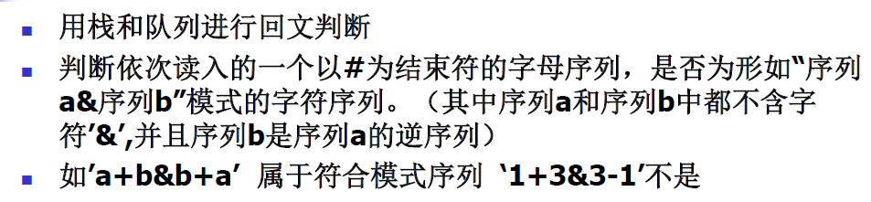
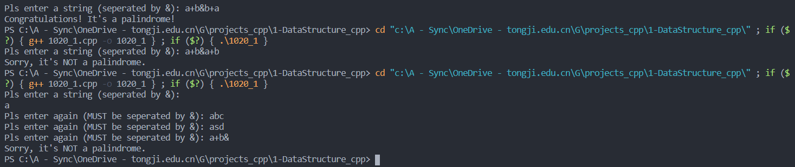

# DSA


## 题目



## 算法分析

定义栈：只定义了栈的常用操作（是否为空，顶部元素，入栈，出栈等）

字符串输入函数：根据题目要求，这里强制要求字符串用&分隔，否则无法通过输入检测

判断是否回文函数：在遇到`&`符号之前把所有字符依次入栈，在之后则挨个出栈比较，如果不相符则立即返回，如果相符则比较到最后判断栈是否为空。保证了`&`前后元素个数不相等不会影响结果。

## 代码

```cpp
# include <iostream>
# include <string>
using namespace std;

/*
1. 定义栈
只实现了需要用到的几个方法
*/
template <class T>
class Stack
{
public:
    Stack(int size);  // 要求构建栈的时候必须指明大小
    ~Stack();
    bool isEmpty();
    bool push(T elem);
    bool pop();
    T top();

private:
    T *stack_buffer;
    int stk_size;
    int stk_top;
};

template <class T>
Stack <T>::Stack(int size)
{
    stk_size=size;  // 顺序栈的大小
    stack_buffer = new T[size];
    stk_top=0;  // 当前栈指针位置，指向栈顶元素的上一个元素
}

template <class T>
Stack <T>::~Stack()
{
    delete []stack_buffer;
}

template <class T>
bool Stack <T>::isEmpty()
{
    if(stk_top == 0)
        return true;
    else
        return false;
}


template <class T>
bool Stack <T>::push(T elem)
{
    // 首先判断栈是否满，如果栈慢直接返回
    if(stk_top >= stk_size)
        return false ;
    // 否则元素先入栈，然后栈顶指针移位
    else
    {
        stack_buffer[stk_top]=elem;
        stk_top++;
        return true;
    }
}

template <class T>
bool Stack <T>::pop()
{
    // 首先判断是否栈空，如果栈空直接返回
    if(isEmpty())
        return false;
    else
    {
        stk_top--;
        return true;
    }
}

template <class T>
T Stack <T>::top()
{
    // 首先判断是否栈空，如果栈空直接返回
    if(isEmpty())
        return false;
    else
        return stack_buffer[stk_top-1];
}


/*
2. 定义字符串输入函数
*/
string inputString()
{
    string str_input;
    cout << "Pls enter a string (seperated by &): ";
    cin >> str_input;
    while (str_input.find('&') == string::npos)
    {
        cout << "Pls enter again (MUST be seperated by &): ";
        cin >> str_input;
    }
    return str_input;
}


/*
3. 定义判断回文数函数
*/
bool isPalindrome(string str)
{
    // 默认把元素挨个压栈，遇到&后开始逐个出栈比较
    Stack<char> stk(str.length());
    int i = 0;
    while (str[i] != '&' && str[i] != '\0')
    {
        stk.push(str[i]);
        i++;
    }
    i++;
    while (str[i] != '\0')
    {
        if (str[i] == stk.top())
            {
                stk.pop();
                i++;
            }
        else
            return false;
    }
    if (stk.isEmpty())
        return true;
    else
        return false;
}


/*
4. 主函数，用于测试和输出
*/
int main()
{
    bool outcome = isPalindrome(inputString());
    if (outcome == 1)
        cout << "Congratulations! It's a palindrome!";
    else
        cout << "Sorry, it's NOT a palindrome.";
    return 0;
}

```

## 运行结果截图



## 编译环境

Visual Studio Code
版本: 1.50.1 (user setup)
提交: d2e414d9e4239a252d1ab117bd7067f125afd80a
日期: 2020-10-13T15:06:15.712Z
Electron: 9.2.1
Chrome: 83.0.4103.122
Node.js: 12.14.1
V8: 8.3.110.13-electron.0
OS: Windows_NT x64 10.0.19041