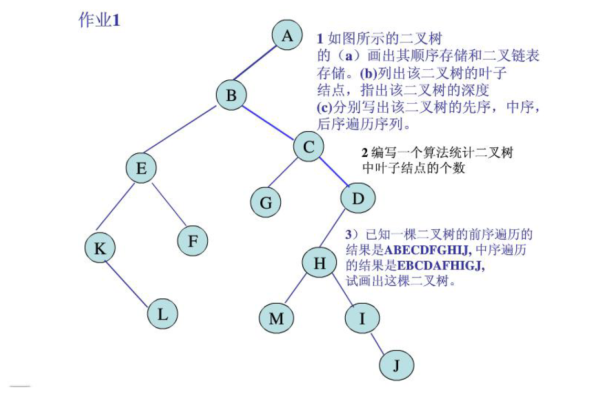
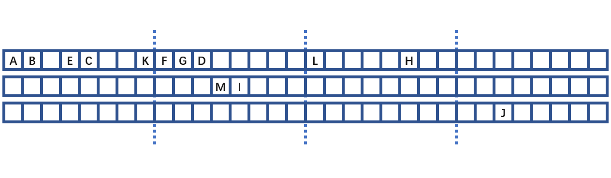
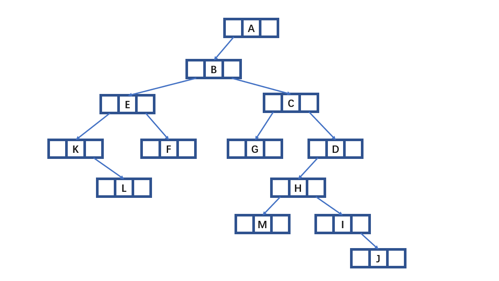
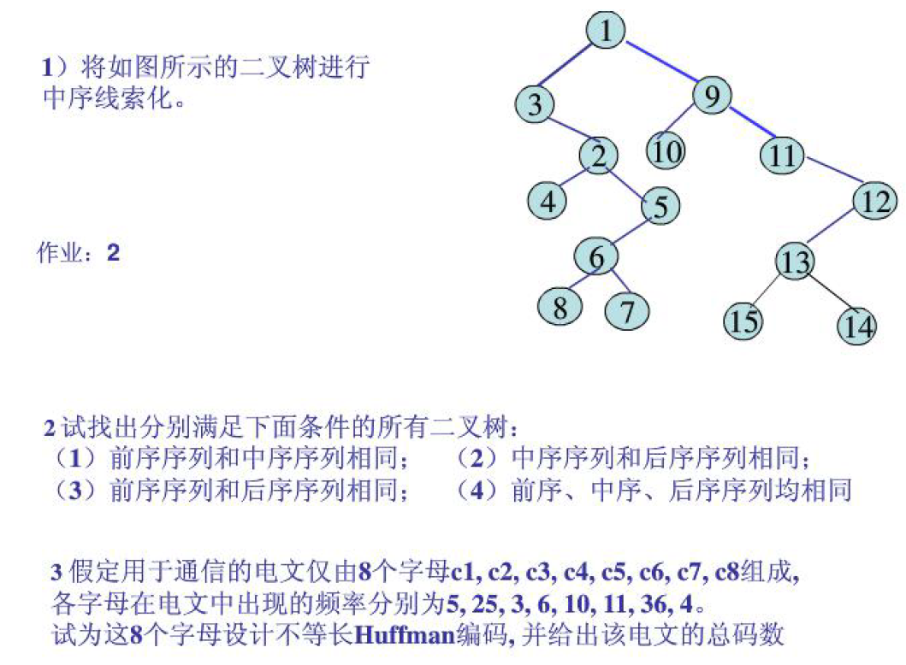
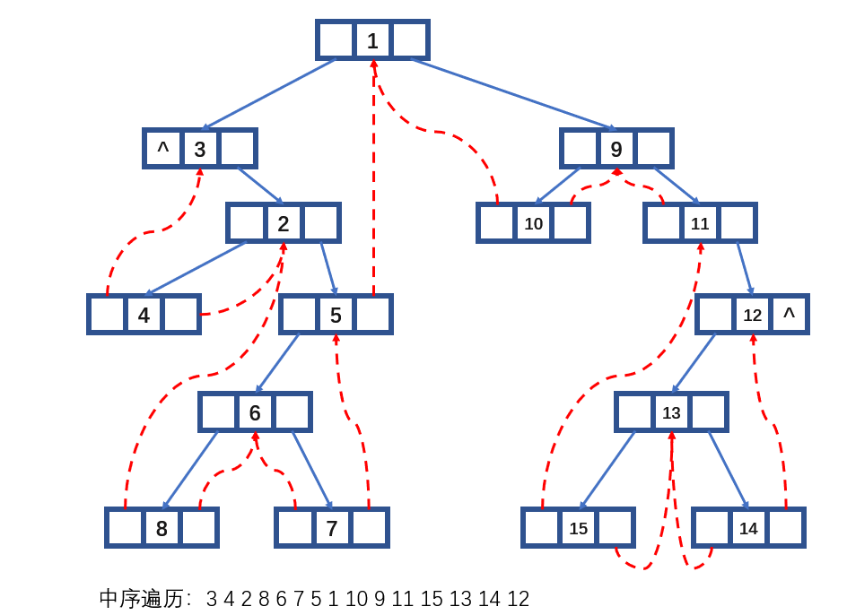

# DSA


## 诚实作业保证

我承诺诚实作业，没有抄袭他人

## 题目一



1. 顺序存储：
2. 二叉链表存储：
3. 叶子结点：`L, F, G, M, J`
4. 深度：`6`
5. 前序遍历：`A, B, E, K, L, F, C, G, D, H, M, I, J`
6. 中序遍历：`K, L, E, F, B, G, C, M, H, I, J, D, A`
7. 后序遍历：`L, K, F, E, G, M, J, I, H, D, C, B, A`
8. 
    ```CPP
    // 画二叉树   
          A
       /     \
      B       F
     / \       \
    E   C       G
         \     / \
          D   H   J
              \         
                I
    ```


## 题目二



1. 
2. 前序序列与中序序列相同：（空树，只有根节点的二叉树，所有的非叶节点都只有右子树的二叉树）
3. 中序序列和后序序列相同：（空树，只有根节点的二叉树，所有的非叶节点都只有左子树的二叉树）
4. 前序序列和后序序列相同：（空树，只有根节点的二叉树）
5. 前中后序列都相同：（空树，只有根节点的二叉树）

