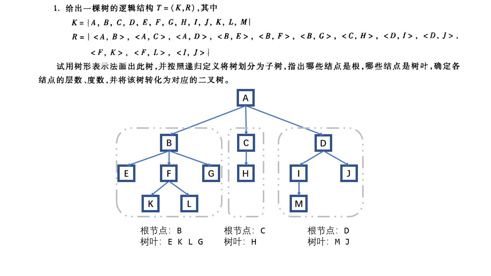
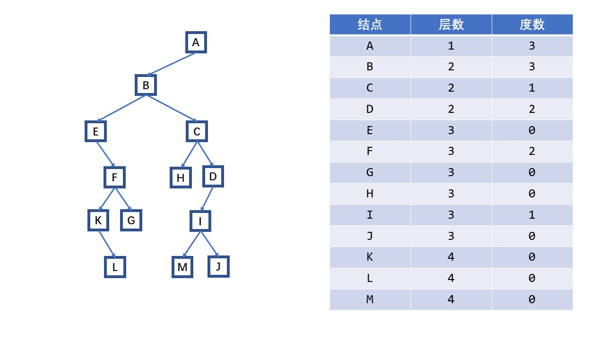
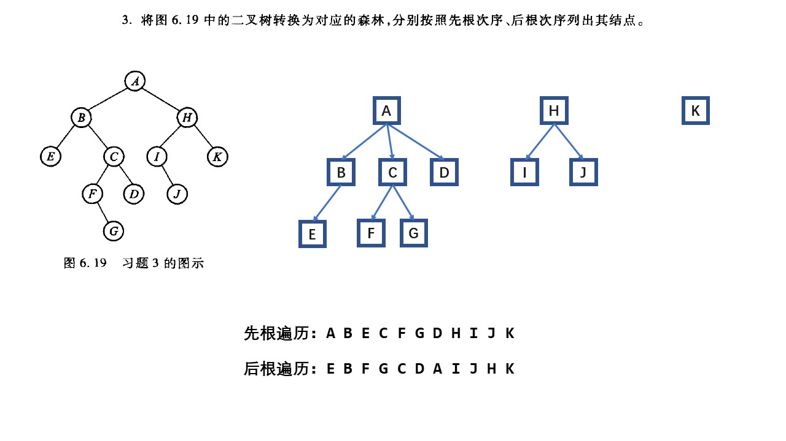
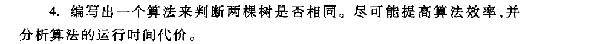
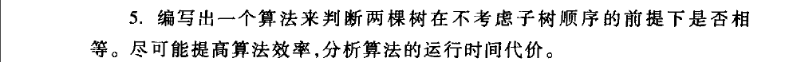

# DSA

## 诚实作业保证

我承诺诚实作业，没有抄袭他人

## 题目

**P159 1 3 4 5** 

### No. 1





### No. 3





### No. 4



1. 分析存储结构：题目只给出了是树，没有给出树的存储结构，故可能是二叉树存储，也可能是其他存储结构。

2. 如果是二叉树存储结构，则此题可以直接采用二叉树相等的判定算法，因为树与二叉树是一一对应的。其时间复杂度为$O(log_2n)$，即取决于用于存储的二叉树的深度。

   判断二叉树`p`和`q`是否相等：

   1. 若`p`和`q`都为空，则必相等
   2. 若`p`和`q`一个为空，另一个不为空，则必不相等；
   3. 若`p`和`q`的值不相等，则必不相等；
   4. 比较`p`和`q`的左子树，如果不相等则必不相等。
   5. 比较`p`和`q`的右子树，如果不相等则必不相等。
   6. `p`和`q`相等。

   ```cpp
   struct Node
   {
       int val;
       Node *left;
       Node *right;
   };
   bool euqualBinTree(Node *root1,Node *root2)
   {
       if (root1 == nullptr && root2 == nullptr) return true;
       if (root1 == nullptr || root2 == nullptr) return false;
       if (root1->val != root2->val) return false;
       return (euqualBinTree(root1->left, root2->left) && euqualBinTree(root1->right, root2->right)); // 直接返回逻辑运算结果
   }
   
   ```

3. 如果结点存放的是结点值和子结点的集合，即`struct Node{int val; vector<Node*> children;};`则比较的方式更为复杂，其基本思路如下：

   1. 若`p`和`q`都为空，则必相等
   2. 若`p`和`q`一个为空，另一个不为空，则必不相等；
   3. 若`p`和`q`的值不相等，则必不相等；
   4. 若`p`和`q`的子结点集合中元素个数不相等，则必不相等；
   5. 依次分别从`p`和`q`的子结点集合`vector<Node*> children`取出元素，进行递归调用比较函数比较取出的元素，一旦不等则返回`false`；
   6. `p`和`q`相等。

   ```cpp
   struct Node
   {
       int val;
       vector<Node*> children;
   };
   bool euqualTree(Node *root1,Node *root2)
   {
       if (root1 == nullptr && root2 == nullptr) return true;
       if (root1 == nullptr || root2 == nullptr) return false;
       if (root1->val != root2->val) return false;
       if (root1->children.size() != root2->children.size()) return false;
       
       int count = root1->children.size();
       for (int i = 0; i < count; i++)
       {w
           if (!euqualTree(root1->children[i], root2->children[i])) return false;
       }
       return true;
   }
   
   ```

   

### No. 5



1. 分析存储结构，这里不考虑子树的顺序，因此存储结构不可能为二叉树存储；这里考虑结点存放的是结点值和子结点的集合，即`struct Node{int val; vector<Node*> children;};`，基本思路还是想采用递归来实现。

2. 递归结束条件

   1. 若`p`和`q`都为空，则必相等
   2. 若`p`和`q`一个为空，另一个不为空，则必不相等；
   3. 若`p`和`q`的值不相等，则必不相等；
   4. 若`p`和`q`的子结点集合中元素个数不相等，则必不相等。

3. 递归过程

   1. 取出`p`的全部子节点，临时存放在`vector<Node*> temp1`；
   2. 取出`q`的全部子节点，临时存放在`vector<Node*> temp2`；
   3. 依次从`temp1`中取出元素和`temp2`中的每一个元素进行递归调用比较
      1. 如果找到了相等的元素，则将该元素从`temp2`中移除，防止重复比较，同时停止内层循环；
      2. 如果始终找不到相等的元素，但是已经把`temp2`循环了一遍，则立刻返回`false`；
   4. 如果最后全部元素比较完成，则返回`true`。

4. 时间复杂度分析：最差情况是每棵树的每个结点都需要比较一遍，其复杂度为`O(mn)`

   

   ```cpp
   struct Node
   {
       int val;
       vector<Node*> children;
   };
   bool simTree(Node *root1,Node *root2)
   {
       if (root1 == nullptr && root2 == nullptr) return true;
       if (root1 == nullptr || root2 == nullptr) return false;
       if (root1->val != root2->val) return false;
       if (root1->children.size() != root2->children.size()) return false;
       vector<Node*> temp1 = root1->children;
       vector<Node*> temp2 = root2->children;
       
       int count = root1->children.size();
       for (int i = 0; i < count; i++)
       {
           for (int j = 0; j < count; i++)
           {
               if (simTree(root1->children[i], root2->children[j]))
               {
                   temp2.erase(temp2.begin()+i);
                   break;
               }
               if (j == count) return false;
           }
       }
       return true;
   }
   
   ```

   


