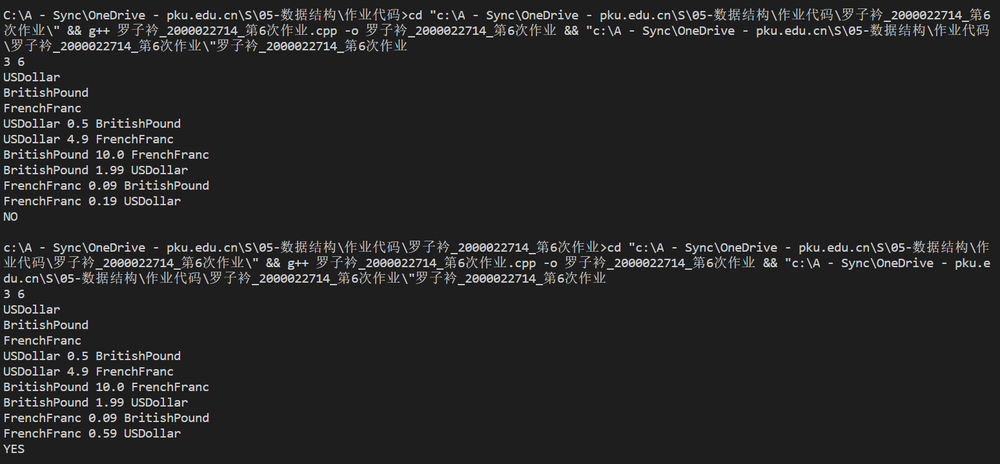

# DSA

https://github.com/ZijinL/cpp_dsa/tree/master/dsa_homework

## 诚实作业保证

我承诺诚实作业，没有抄袭他人

## 题目

**上机题 1**


## 解答

1. 存储结构：邻接矩阵，矩阵中存放`double`，代表两种货币的换算指数。
2. 输入数据：货币种数、汇率换算次数、汇率换算详情
3. 输出数据：`Yes`-可以套汇；`No`-不可以套汇
4. 时间复杂度：三重循环，应该是$O(n^3)$

**解题思路：**

1. 初始化一个邻接矩阵
2. 循环每一个顶点，检查是否有可能有套汇的可能
   1. 初始化遍历的参数、访问位
   2. 以该顶点为出发点进行DFS
   3. 如果有成环且系数大于1则返回Yes


## 代码详情

```cpp
#include <iostream>

using namespace std;

#define MAX_NUM 20 // 货币种类上限

class AdjMatrix
{
private:
    double matrix[MAX_NUM][MAX_NUM]; // 汇率关系的邻接矩阵
    string node[MAX_NUM]; // 货币名称-结点编号
    int currency_num; // 货币数量
    int exchange_num; // 汇率换算数量
    double value; // 汇率换算因子
    int flag; // 是否能套汇
    int Visit[MAX_NUM]; // 每个货币的访问标记位
    void DFS(int start);
public:
    AdjMatrix(int n)
    {
        currency_num = n;
        flag=0;
    }
    int getIndex(string s); // 获取指定货币编号
    void initMatrix(); // 初始化邻接矩阵
    void DFSTraverse();
};


// 1. 获取指定货币的编号
int AdjMatrix::getIndex(string s)
{
    for(int i = 0; i < currency_num; i++) if(node[i] == s) return i;
    return -1;
}


// 2. 初始化邻接矩阵
void AdjMatrix::initMatrix()
{
    // 所有汇率换算全置0
    for(int i = 0; i < currency_num; i++)
        for(int j=0; j < currency_num; j++)
            matrix[i][j] = 0;

    // 输入汇率换算次数 - 边数
    cin >> exchange_num;
    // 输入货币名称 USDollar
    for(int i = 0; i < currency_num; i++)
    {
        string s1;
        cin >> s1;
        node[i] = s1;
    }
    // 输入汇率换算关系 USDollar 6.9 RMB
    for(int i=0; i < exchange_num; i++)
    {
        string s1, s2;
        double currency;
        int index1, index2;
        cin>>s1;
        cin>>currency;
        cin>>s2;
        index1 = getIndex(s1);
        index2 = getIndex(s2);
        matrix[index1][index2] = currency;
    }
}


// 3. 深度遍历接口函数
void AdjMatrix::DFSTraverse()
{
    // 循环每一个顶点 判断以该顶点为起点是否找到有效套汇路径
    for(int current = 0; current < currency_num; current++)
    {
        value = 1.0; // 重置换算因子
        // 初始化此次访问的各顶点访问位
        for(int i = 0; i < currency_num; i++)
        {
            if(i == current)
                Visit[i] = 2; // 表示起始点
            else
                Visit[i] = 0; // 访问位归0
        }
        DFS(current);
    }

    // 输出是否存在套汇的结果
    if(flag == 1) cout << "YES";
    else cout << "NO";
    cout << endl;
}


// 4. 从某点开始进行深度递归访问
void AdjMatrix::DFS(int start)
{
    int neighbors_num;

    // 从某点开始深度遍历 该点访问位置1
    if(Visit[start] == 0) Visit[start] = 1;

    int neighbors [currency_num]; // 记录全部相邻的点
    for(int i = 0; i < currency_num; i++) neighbors[i] = -1; // 初始化相邻的标志位-1

    // 找出当前顶点所有相邻顶点
    neighbors_num = 0; 
    for(int i = 0; i < currency_num; i++)
    {
        if(matrix[start][i] != 0) // 邻接矩阵不为零的点
        {
            neighbors[neighbors_num] = i; // 记录每个相邻点的编号
            neighbors_num++; // 记录相邻点的数量
        }
    }

    // 访问其所有相邻的点
    for(int each_neighbor: neighbors)
    {
        if (each_neighbor == -1) break; // 检查是否还有相邻顶点未访问

        // 如果遇上新的顶点 继续深度遍历
        if(Visit[each_neighbor] == 0)
        {
            value = value*matrix[start][each_neighbor];
            DFS(each_neighbor);
        }
        // 如果成环 则检查是否有可能套利
        else if(Visit[each_neighbor] == 2)
        {
            if(value*matrix[start][each_neighbor] > 1.0) flag = 1; // 乘积大于1则有套利可能
        }
    }
}


int main()
{
    int currency_num;
    cin >> currency_num;
    AdjMatrix exchange(currency_num);
    exchange.initMatrix();
    exchange.DFSTraverse();
    return 0;
}


```


## 运行截图



