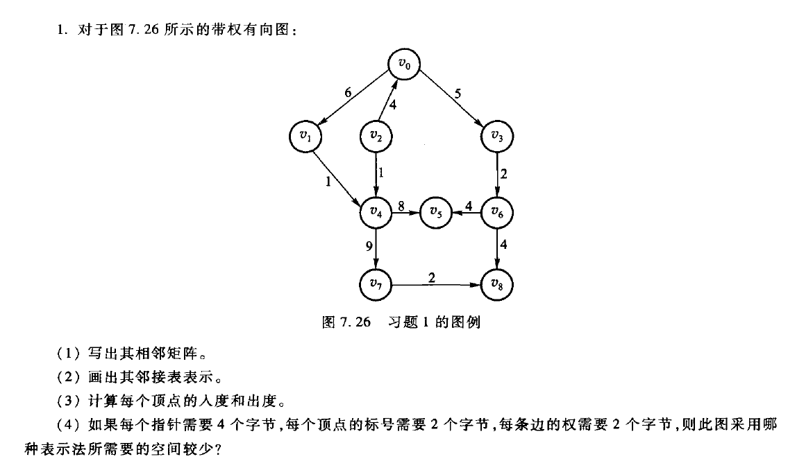
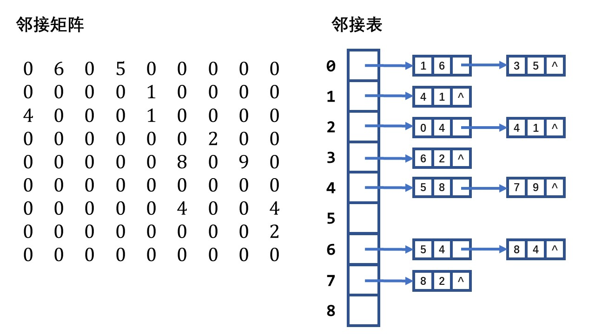
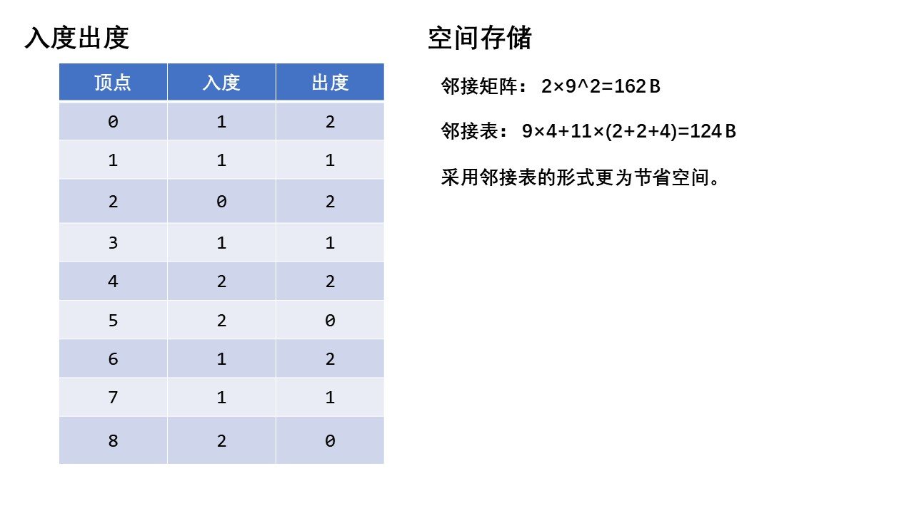
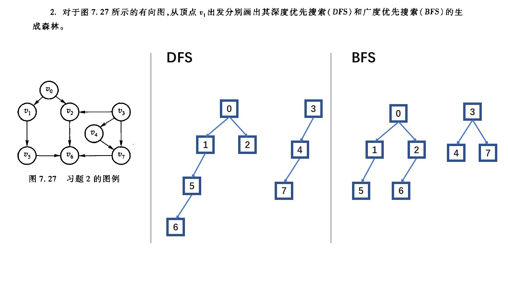
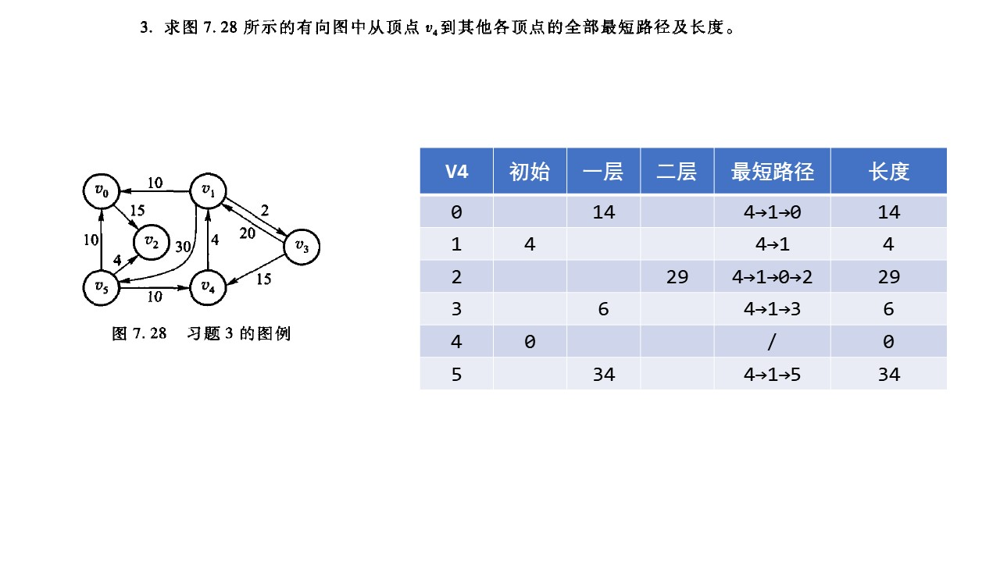
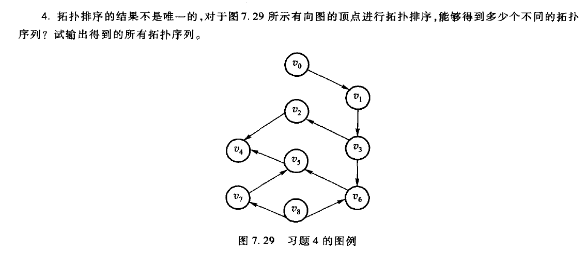
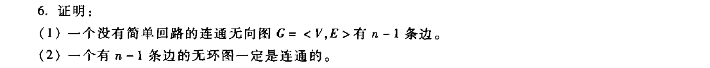

# DSA

https://github.com/ZijinL/cpp_dsa/tree/master/dsa_homework

## 诚实作业保证

我承诺诚实作业，没有抄袭他人

## 题目

**课后习题 P190 1 2 3 4 6 23** 

## No. 1






## No. 2



## No. 3



## No. 4



```
0 1 3 2 8 6 7 5 4
0 8 7 1 3 6 5 2 4
8 7 0 1 3 6 5 2 4
```

可以DFS+回溯来得到所有结果，参考链接：https://www.cnblogs.com/xwh-blogs/p/12721648.html

## No. 6



1. 数学归纳法证明

   不妨设该连通图中顶点数$n$，边数$s$

   1. 对于$n=1$而言，显然，$s=n-1=0$ 
   2. 假设对于$n$有$s=n-1$，则当$n=n+1$时，添加一个结点$a$，至少需要添加一条边与原图相连。
   3. 如果添加的边数为2条（更多边同理），不妨设这两条边分别于结点$b,c$。由于$b,c$是连通的，而$a$又分别与这两个结点相连，即构成了简单回路。因此当增加结点时，只能增加一条边，因此当$n=n+1$时，$s=n$。
   4. 得证

2. 证明

   1. 假设一个有$n-1$条边的无环图中有$k$个无环的连通分量。
   2. 通过增加$k-1$条边将这些连通分量连接成一个$n$个顶点的无环连通图，由第一问可得，连接后的$n$个顶点的无环连通图中有$n-1$条边，则原不连通的无环图中有$(n-1-k)$条边。而题给条件原图是$n-1$条边，则$(n-1)=(n-1-k)$，因此$k=0$。
   3. 因此原图中只有一个无环的连通分量，得证。


