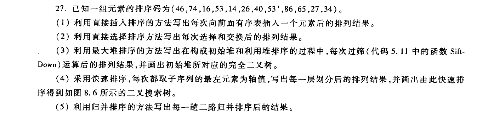

<head>
    <script src="https://cdn.mathjax.org/mathjax/latest/MathJax.js?config=TeX-AMS-MML_HTMLorMML" type="text/javascript"></script>
    <script type="text/x-mathjax-config">
        MathJax.Hub.Config({
            tex2jax: {
            skipTags: ['script', 'noscript', 'style', 'textarea', 'pre'],
            inlineMath: [['$','$']]
            }
        });
    </script>
</head>

# DSA

马上就要考研了 最近作业都没时间写算法啦 见谅

由于github的markdown不支持latex的渲染 所以预览的公式显示会有错误

## 诚实作业保证

我承诺诚实作业，没有抄袭他人

## 题目一

**P239 24, 27**


**默认为数组结构顺序存储**

### 找最小值

```cpp
int findMinValue(vector<int> unorderedArrray) {
    int min = unorderedArrray[0];
	for (int item: unorderedArrray) {
    	if (item < min) min = item;
	}
	return min
}
```

时间复杂度：$O(n)$，不需要排序；

空间复杂度：$O(1)$ 

### 找最大值

```cpp
int findMaxValue(vector<int> unorderedArrray) {
    int max = unorderedArrray[0];
	for (int item: unorderedArrray) {
    	if (item > max) max = item;
	}
	return max
}
```

时间复杂度：$O(n)$，不需要排序；

空间复杂度：$O(1)$ 

### 计算算数平均值

```cpp
int calAvgVal(vector<int> unorderedArrray) {
    int sum = 0;
	for (int item: unorderedArrray) {
    	sum += item;
	}
	return sum/unorderedArrray.size();
}
```

时间复杂度：$O(n)$，不需要排序；

空间复杂度：$O(1)$ 

### 找中位数

算法思路：采用和快速排序类似的分治策略，不需要排序。

1. 定义一个`int partition(int *unorderedArray, int pivot, int begin, int end)`获取指定元素所在的位置；
2. 从待划分的最左边第一个数作为轴值，然后用划分函数求得轴值在有序数组中的位置。
3. 如果该位置序号等于中位数的位置序号，则用临时变量记录下该位置的值。如果大于中位数位置序号，则对右侧的数组继续调用该划分函数，直到找到中位数位置的值。
4. 需要注意的是，由于数组长度可能是奇数和偶数；奇数的时候，只需要找到$\frac n 2$的值即可；偶数的时候，需要申请两个临时变量，分别用于保存$\frac{n-1}2,\ \frac n 2$的值。
5. 如果总长度为奇数，则找到中位数位置上的数即可，如果是偶数，则需要计算中间两个数的平均值。
6. 时间复杂度：$O(n)$，因此没有必要先排序。

如果是已排序数组中位数，则直接输出$\frac 12(a[\frac{n-1}2] + a[\frac n 2])$即可。S

### 找众数

**方法一：桶式排序**

1. 先申请一个和元素长度一样的数组用于存放各元素出现的次数。
2. 然后遍历一遍全部元素，将其出现次数填入上述数组。
3. 最后遍历一次上述数组，最大值对应的元素既是众数。
4. 时间复杂度：$O(m+n)$；空间复杂度为$O(m)$；$n$是元素总个数，$m$是元素范围的长度。

**方法二：先排序后统计**

1. 先通过快速排序/归并排序/堆排序对数组进行排序，然后转化为有序数组的众数问题。
2. 定义一个保存众数元素排序码的数组和出现次数的整型，`int sortKey[]; int count = 0;`；
3. 循环遍历有序数组，统计连续出现数字出现的个数，即从第一次出现该数字到开始出现其他数字的区间长度
4. 如果当前数字出现长度大于众数出现次数，则清空排序码数组，将当前数字存入排序码数组，将出现次数记录在众数出现次数；
5. 如果当前数字出现长度等于众数出现次数，则将当前数字加入排序码数组尾部；
6. 循环遍历一遍之后，输出排序码数组`sortKey`中的元素，即是众数；`count`中即是众数出现次数。
7. 时间复杂度：$O(n\log n)$；空间复杂度：$O(1)$；


## 题目二



### 直接插入排序

```cpp
(1) 直接插入排序
    46 | 74 16 53 14 26 40 53' 86 65 27 34
    46 74 | 16 53 14 26 40 53' 86 65 27 34
    16 46 74 | 53 14 26 40 53' 86 65 27 34
    16 46 53 74 | 14 26 40 53' 86 65 27 34
    14 16 46 53 74 | 26 40 53' 86 65 27 34
    14 16 26 46 53 74 | 40 53' 86 65 27 34
    14 16 26 40 46 53 74 | 53' 86 65 27 34
    14 16 26 40 46 53 53' 74 | 86 65 27 34
    14 16 26 40 46 53 53' 74 86 | 65 27 34
    14 16 26 40 46 53 53' 65 74 86 | 27 34
    14 16 26 27 40 46 53 53' 65 74 86 | 34
    14 16 26 27 34 40 46 53 53' 65 74 86 |
```

### 直接选择排序
```cpp
(2) 直接选择排序
    | 46 74 16 53 14 26 40 53' 86 65 27 34
    14 | 46 74 16 53 26 40 53' 86 65 27 34
    14 16 | 46 74 53 26 40 53' 86 65 27 34
    14 16 26 | 46 74 53 40 53' 86 65 27 34
    14 16 26 27 | 46 74 53 40 53' 86 65 34
    14 16 26 27 34 | 46 74 53 40 53' 86 65
    14 16 26 27 34 40 | 46 74 53 53' 86 65
    14 16 26 27 34 40 46 | 74 53 53' 86 65
    14 16 26 27 34 40 46 53 | 74 53' 86 65
    14 16 26 27 34 40 46 53 53' | 74 86 65
    14 16 26 27 34 40 46 53 53' 65 | 74 86
    14 16 26 27 34 40 46 53 53' 65 74 | 86
    14 16 26 27 34 40 46 53 53' 65 74 86 |
```

### 堆排序（最大堆）


### 快速排序

```cpp
(4) 快速排序
    46  74  16  53  14  26  40   53'  86    65   27  34
    34  27  16  40  14  26 |46|  53'  86    65   53  74
    26  27  16  14 |34| 40 |46|  53  |53'|  65   86  74
    14  16 |26| 27 |34| 40 |46|  53  |53'| |65|  74  86
   |14| 16 |26| 27 |34| 40 |46|  53  |53'| |65| |74| 86
    14  16  26  27  34  40  46   53   53'   65   74  86
```


### 二路归并排序
```cpp
(5) 二路归并排序
    [46] [74] [16] [53] [14] [26] [40] [53'] [86] [65] [27] [34]
    [46   74] [16   53] [14   26] [40   53'] [65   86] [27   34]
    [16   46   53   74] [14   26   40   53'] [27   34   65   86]
    [14   16   26   40   46   53   53'  74]  [27   34   65   86]
    [14   16   26   27   34   40   46   53    53'  65   74   86]
```


