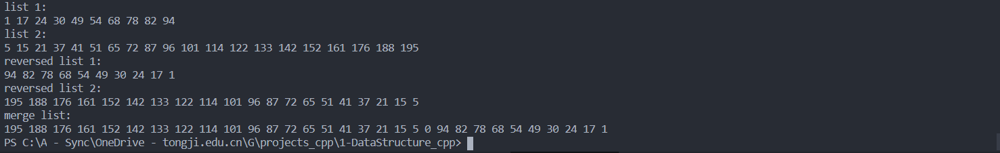

# DSA


## 题目

将两个非递减的有序链表合并为一个非递增的有序链表。（要求同上）

## 算法分析

这个题其实直接翻转列表加上合并列表就可以，虽然代码看似麻烦，但是时间复杂度还是$O(max(m, n))$的，并不会因此增加时间复杂度，而且由于采取了分步解决的方式，代码更易实现，易懂。当然，也可以循环遍历，利用头节点的空闲指针实现逐个结点比较翻转，然后最后翻转剩下的列表。

## 代码

```cpp
# include <iostream>
# include <stdlib.h>
using namespace std;

// 1. 定义链表结点
struct ListNode
{
    int data;
    ListNode *next;
    ListNode() : data(0), next(nullptr) {}
    ListNode(int val) : data(val), next(nullptr) {}
};

// 2. 定义链表合并函数
ListNode* MergeList(ListNode* list_1, ListNode* list_2)
{
    // 递归结束条件，遍历完成，指针为空
    if (list_1 == nullptr)
        return list_2;
    if (list_2 == nullptr)
        return list_2;
    // 缩小问题规模，从小到大结点逐步减1
    if (list_1->data > list_2->data)
    {
        list_1->next = MergeList(list_1->next, list_2);
        return list_1;
    }
    else
    {
        list_2->next = MergeList(list_2->next, list_1);
        return list_2;        
    }   
}

// 3. 定义反转列表函数
ListNode* ReverseList(ListNode* head)
{
    if (head == nullptr)
    {
        return head;
    }
    ListNode *pre, *cur;
    pre = head->next;
    cur = pre->next;
    pre->next = nullptr;
    while(cur != nullptr)
    {
        head->next = pre;
        pre = cur;
        cur = cur->next;
        pre->next = head->next;
    }
    head->next = pre;
    return head;
}

// 4. 定义初始化链表函数，用于准备测试用例
ListNode* InitList(int m)
{
    ListNode *p_head = new ListNode();
    ListNode *p_tail;
    p_tail = p_head;
    for (int i = 0; i < m; i++)
    {   
        // 这里直接使用大小递增的随机数，避免随机生成后还要排序
        ListNode *p_new = new ListNode((rand()%10 + 10*i));
        p_tail->next = p_new;
        p_tail = p_new;
    }
    return p_head;
}

// 5. 显示函数，用于遍历输出链表全部元素
void PrintList(ListNode* head)
{
    ListNode* p = head->next;
    while (p != nullptr)
    {
        cout << p->data << " ";
        p = p->next;
    }
}

// 6. 主函数，进行测试
int main()
{
    ListNode *p1 = InitList(10);
    ListNode *p2 = InitList(20);
    cout << "list 1: " << endl;
    PrintList(p1);
    cout << endl << "list 2: " << endl;
    PrintList(p2);
    ListNode* p3 = ReverseList(p1);    
    ListNode* p4 = ReverseList(p2);
    cout << endl << "reversed list 1: " << endl;
    PrintList(p3);
    cout << endl << "reversed list 2: " << endl;
    PrintList(p4);
    ListNode* p5 = MergeList(p3, p4);
    cout << endl << "merge list: " << endl;
    PrintList(p5);
    return 0;
}
```

## 运行结果截图

