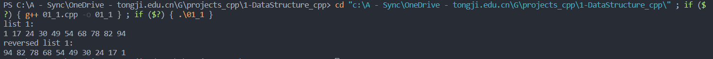

# DSA


## 题目

设计算法，通过遍历一趟，将链表中所有结点的链接方向逆转（使用原表存储空间）

## 算法分析

双指针法，并利用了头节点的空闲指针，逐个结点遍历完成指针的反转，时间复杂度$O(n)$

## 代码

```cpp
# include <iostream>
# include <stdlib.h>
using namespace std;

// 1. 定义链表结点
struct ListNode
{
    int data;
    ListNode *next;
    ListNode() : data(0), next(nullptr) {}
    ListNode(int val) : data(val), next(nullptr) {}
};

// 2. 反转列表，本题核心代码，利用头节点多余的指针来完成
ListNode* ReverseList(ListNode* head)
{
    if (head == nullptr)
    {
        return head;
    }
    ListNode *pre, *cur;
    pre = head->next;
    cur = pre->next;
    pre->next = nullptr;
    while(cur != nullptr)
    {
        head->next = pre;
        pre = cur;
        cur = cur->next;
        pre->next = head->next;
    }
    head->next = pre;
    return head;
}

// 3. 定义初始化链表函数，用于准备测试用例
ListNode* InitList(int m)
{
    ListNode *p_head = new ListNode();
    ListNode *p_tail;
    p_tail = p_head;
    for (int i = 0; i < m; i++)
    {   
        // 这里直接使用大小递增的随机数，避免随机生成后还要排序
        ListNode *p_new = new ListNode((rand()%10 + 10*i));
        p_tail->next = p_new;
        p_tail = p_new;
    }
    return p_head;
}

// 4. 显示函数，用于遍历输出链表全部元素
void PrintList(ListNode* head)
{
    ListNode* p = head->next;
    while (p != nullptr)
    {
        cout << p->data << " ";
        p = p->next;
    }
}

// 5. 主函数，进行测试
int main()
{
    ListNode *p1 = InitList(10);
    cout << "list 1: " << endl;
    PrintList(p1);
    ListNode* p2 = ReverseList(p1);
    cout << endl << "reversed list 1: " << endl;
    PrintList(p2);
    return 0;
}
```

## 运行结果截图

