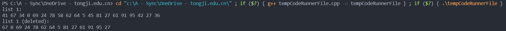

# DSA


## 题目

设计一个算法，删除递增有序链表中值大于 min(i) 且小于 max(k) 的所有元素（ i 和 k 是给定的两个参数，其值可以和表中的元素相同，也可以不同）

## 算法分析

循环遍历，符合条件即删，空即返回，时间复杂度$O(n)$

## 代码

```cpp
# include <iostream>
# include <stdlib.h>
using namespace std;

// 1. 定义链表结点
struct ListNode
{
    int data;
    ListNode *next;
    ListNode() : data(0), next(nullptr) {}
    ListNode(int val) : data(val), next(nullptr) {}
};

// 2. 遍历链表，删除对应结点
ListNode* DeleteNode(ListNode* head, int i, int k)
{
    ListNode *pre = head;
    ListNode *cur = head->next;
    while (cur)
    { 
        if (cur->data > i && cur->data < k)
        {
            pre->next = cur->next;
            cur = pre->next;
        }
        else
        {
            pre = cur;
            cur = cur->next;
        }
    }
    return head;
}

// 3. 定义初始化链表函数，用于准备测试用例
ListNode* InitList(int m)
{
    ListNode *p_head = new ListNode();
    ListNode *p_tail;
    p_tail = p_head;
    for (int i = 0; i < m; i++)
    {   
        ListNode *p_new = new ListNode((rand()%100));
        p_tail->next = p_new;
        p_tail = p_new;
    }
    return p_head;
}

// 4. 显示函数，用于遍历输出链表全部元素
void PrintList(ListNode* head)
{
    ListNode* p = head->next;
    while (p != nullptr)
    {
        cout << p->data << " ";
        p = p->next;
    }
}

// 5. 主函数，进行测试
int main()
{
    ListNode *p1 = InitList(20);
    cout << "list 1: " << endl;
    PrintList(p1);
    // 自定义删除范围
    int minNum = 30;
    int maxNum = 60;
    cout << endl << "list 1 (deleted): " << endl;
    ListNode *p2 = DeleteNode(p1, minNum, maxNum);    
    PrintList(p2);
    return 0;
}

```

## 运行结果截图


