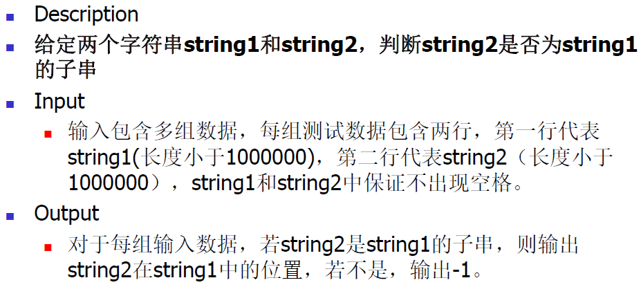
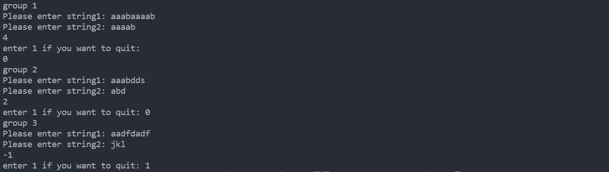

# DSA


## 题目



## 算法分析

第一步：生成`next`数组，数组第一位从1开始编号

第二部：利用`next`数组对`string`做一遍kmp

其他：自定义`String`类实现起来有点麻烦

## 代码

```cpp
#include <iostream>
using namespace std;

// 定义一个计算数组/指向数组的指针的长度
int strrlen(const char *p)
{
    int i = 0;
    while (p[i] != '\0')
    {
        i++;
    }
    return i;
}

// 定义一个比较两个数组的相对大小的函数
int strrcmp(const char * str1, const char * str2)
{
    int i = 0;
    while (str1[i] && str2[i])
    {
        if(str1[i] < str2[i])
            return -1;
        else if(str1[i] > str2[i])
            return 1;
        i++;
    }
    return 0;
}

// 定义一个数组拷贝函数
void strrcpy(char *dest, const char *source)
{
    int i = 0;
    while (source[i] != '\0')
    {
        dest[i] = source[i];
        i++;
    }
    dest[i] = '\0';
}

// 定义一个String类
class String
{
private:
    char *str_data;  // 储存字符串的数组
    int size;  // 字符串的长度
public:
    // 默认构造函数
    String()
    {
        size = 0;
        char str_data [1];
		str_data[0] = '\0';
    }

    // 构造函数
    String(const char *str)
    {
        size = strrlen(str) / sizeof(str[0]);
        str_data = new char[size + 1];
        strrcpy(str_data, str);
    }

    // 析构函数  
    ~String()
    {
        // delete[] str_data;
    }

    // 定义下标运算符
    char& operator[](int i)
    {
        return str_data[i];
    }

    //提供获取长度的接口
    int length()
    {
        return size;
    }

    // 定义输出运算符
    friend ostream &operator<<(ostream& output, const String &str)
    {
        output << str.str_data;
        return output;
    }

    // 定义输入运算符
    friend istream &operator>>(istream& input, String &str)
    {
        input >> str.str_data;
        str.size = strrlen(str.str_data);
        return input;
    }

    // 定义小于比较运算符
    bool operator<(const String & str)
    {
        if(strrcmp(str_data, str.str_data) < 0)
            return true;
        else
            return false;
    }

    // 定义大于比较运算符
    bool operator>(const String & str)
    {
        if(strrcmp(str_data, str.str_data) > 0)
            return true;
        else
            return false;
    }

    // 定义相等比较运算符
    bool operator==(const String & str)
    {
        if(strrcmp(str_data, str.str_data) == 0)
            return true;
        else
            return false;
    }

    // 临时定义的用来获取字符串数据的函数
    char *getData()
    {
        return str_data;
    }

};


// 1. 生成next数组
void gen_next(String str, int next[])
{
    /*
    此处生成的是next数组，因此next从1开始
    定义i,j两个数，指向两个待比较的位次
    其中j只向右移动，以减少比较次数
    注意这里字符下标是从0开始
    */
    int temp_length = str.length();
    int i = 0, j = 1;
    next[1] = 0;
    while(j < temp_length) 
    {
        if (i==0 || str[i-1]==str[j-1])
        {
            i++;
            j++;
            next[j] = i;
        }
        else
        {
            i = next[i];
        }
    }
}


// 2. 生成nextval数组，进一步减少比较次数
void gen_nextval(String str, int nextval[])
{
    /*
    此处生成的是nextval数组，nextval从1开始
    定义i,j两个数，指向两个待比较的位次
    其中j只向右移动，以减少比较次数
    而i一直左移到str[i] != str[next[i]]
    相比next数组进一步减少在KMP中的比较次数
    注意这里字符串下标从0开始
    */
    int temp_length = str.length();
    int i = 0, j = 1;
    nextval[1] = 0;
    while(j < temp_length) 
    {
        if (i==0 || str[i-1]==str[j-1])
        {
            i++;
            j++;
            if (str[i-1] == str[j-1])
            {
                nextval[j] = nextval[i];
            }
            else
            {
                nextval[j] = i;
            }
        }
        else
        {
            i = nextval[i];
        }
    }
}

//3. 定义一个KMP匹配的函数
int KMP(String string1, String string2, int next[])
{
    /*
    i: 指向目标串的当前比较位置
    j: 指向模式串的当前比较位置
    注意字符串下标从0开始
    */
    int i = 0, j = 0;
    while (i < string1.length() && j < string2.length())
    {
        if (j==-1 || string1[i]==string2[j])
        {
            i++;
            j++;
        }
        else
            j = next[j+1] - 1;
    }
    // 模式串走到终点即表明匹配成功
    if (j == string2.length())
        return i - string2.length();
    else
        return -1;
}

//4. 定义主函数进行测试
int main()
{
    // 方法一：直接调用istream输入目标串
    // String string1;
    // cout << "Please enter string1: ";
    // cin >> string1;
    // cout << string1.getData();
    // 定义的输入>>运算符有点问题，调试不出来
    // 这里还是用临时数组，但是就没办法实现istream的不定长输入
    // 方法二：先输入再调用构造函数输入模式串
    int flag = 0;
    int group_num = 1;
    while (flag == 0)
    {
        cout << "group " << group_num << endl;
        cout << "Please enter string1: ";
        char temp1[128];
        cin >> temp1;
        String string1(temp1);

        cout << "Please enter string2: ";
        char temp2[128];
        cin >> temp2;
        String string2(temp2);

        int next[string2.length()+1]; // next数组有效位从1开始
        gen_next(string2, next);
        cout << KMP(string1, string2, next) << endl;

        cout << "enter 1 if you want to quit: ";
        cin >> flag;
        if (flag==1) break;
        else group_num += 1;
    }  
}

```

## 运行结果截图




## 编译环境

Visual Studio Code
版本: 1.50.1 (user setup)
提交: d2e414d9e4239a252d1ab117bd7067f125afd80a
日期: 2020-10-13T15:06:15.712Z
Electron: 9.2.1
Chrome: 83.0.4103.122
Node.js: 12.14.1
V8: 8.3.110.13-electron.0
OS: Windows_NT x64 10.0.19041